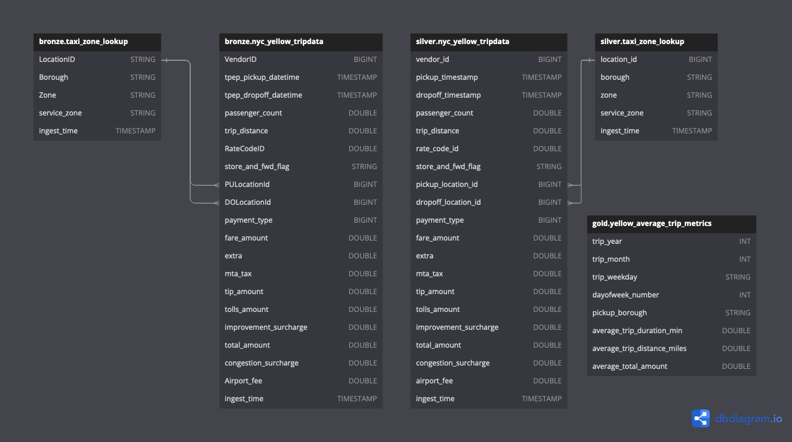

## 1. Introduction

This is an end-to-end implementation of a data pipeline using the open TLC Yellow Taxi Trip Records from NYC: https://www.nyc.gov/site/tlc/about/tlc-trip-record-data.page

It is fully runnable on a local machine via `docker`.

Prerequisites:
* Docker daemon is running
* The following ports will need to be unoccupied:
    * `8888`
    * `8080`
    * `10000`
    * `10001`
    * `8181`
    * `9001`
    * `9000`
    
### 1.1 Quickstart
1. Docker compose up - note that it may take a while (up to 10 minutes) to pull and build the images.
```sh
docker compose up --build -d
```

2. Once the containers are up, wait 1-2 minutes for services to start up, then go to Jupyter Lab from your web browser: http://localhost:8888/lab

3. Locate `1. Taxi_Zone_Lookup.ipynb`, right click on it and click `Create Notebook Job`


4. Ensure that `Run job with input folder` and `Run now` is selected, then hit `Create`


5. Wait for the job to be completed


6. Repeat steps 3, 4, and 5 for `2. Yellow_TripData.ipynb`. Note to only start this job after `1. Taxi_Zone_Lookup.ipynb` job has finished.

7. Explore the data via SQL, or PySpark via `Explore.ipynb`


### 1.2 Architecture

These are the services used for the data ingestion, processing, storage, catalog, and warehouse:

* Apache Spark - data processing engine
* Minio - S3 compatible object storage engine; all ingested data is stored here.
* Apache Iceberg - a table format for analytics
* Iceberg REST Catalog - catalog that integrates into Spark engine, responsible for tracking table metadata, creating/dropping/renaming tables
* JupyterLab - interact with Spark via pyspark and schedule ingestion, cleansing, and transformation jobs

For this data warehouse, we have a single Iceberg catalog called `demo`, and 3 databases:

* `bronze` - raw unprocessed data, schema is inferred, but supports schema evolution; note that it is possible for this zone to have dirty or duplicated data; the data here is meant to be explored, then cleansed into a well-defined schema into the silver zone.  
* `silver` - cleansed, deduplicated, well-defined and reliable schema - the data here is can be reliably used for analysis or exploration by business users including data analysts and data scientists. 
* `gold` - refined datasets that may involve joining or aggregation of silver tables that will be used for dashboards, visualization, or high-level analysis.

### 1.3 Final Schema:



### 1.4 Other Notes:
* You can access the `minio` portal via http://localhost:9000 - the username is `admin` and the password is `password` (set up in `docker-compose.yaml`), purely for the sake of demonstration and simplicity purposes. This would not be the case in a production environment.

* You can access the Spark portal via http://localhost:8080

* You can access JupyterLab via http://localhost:8888

## 2. Data Ingestion

For data ingestion into the data warehouse, there are two main steps:

1. Downloading the raw data file into the `landing_zone` of `minio`
2. Loading the data file into the `bronze` database

For both of these steps, there are functions in the `spark/notebooks.utils.py`:

```python
from urllib.request import urlretrieve 
import pyspark.sql.functions as f
import os

def ingest_landing(src, local_dest, minio_dest, minio_client):
    """
    A function that uses a GET request to download the file to minio landing zone
    """
    urlretrieve(src, local_dest) # GET request to download the file locally 
    
    # check if landing bucket exists, if not create it
    found = minio_client.bucket_exists("landing") 
    
    if not found: 
        minio_client.make_bucket("landing")  
        
    minio_client.fput_object("landing", minio_dest, local_dest) # PUT file into minio object
    os.remove(local_dest) # remove file from local
    print(f"Ingestion {src} Successful") # log success

def load_bronze(local_src, minio_src, dest_table, minio_client, spark, file_type="parquet"):
    """
    Load landing data into the bronze database
    """
    minio_client.fget_object("landing", minio_src, local_src) # get landing file object from minio
    
    # add ingest time
    if file_type == "parquet":
        df = spark.read.parquet(local_src)
    elif file_type == "csv":
        df = spark.read.option("header", "true").csv(local_src)
    df = df.withColumn("ingest_time", f.current_timestamp())
    
    # if the table doesn't exist create the table, otherwise append
    exists = spark.catalog.tableExists(dest_table)
    if not exists:
        df.write.saveAsTable(dest_table)
        spark.sql(f"ALTER TABLE {dest_table} SET TBLPROPERTIES ('write.spark.accept-any-schema'='true')")
    else:
        df.writeTo(dest_table).option("mergeSchema","true").append()
    print(f"Load {minio_src} to Bronze Success")
```

Step 1 is achieved by a GET request to the resource, downloading to the local filesystem, PUT-ing the object into `minio`, and finally removing the file from the local filesystem.

Step 2 is achieved by loading the data file from `minio` landing zone, adding an `ingest_timestamp` column with the current time, then creating a table in the `bronze` database (if it does not exist) with supported schema evolution properties, or appending to the table in `bronze` if it already exists.

By having these functions in `utils.py`, we have a modular approach and an easy way to introduce more pipelines in the future to accomdate for more data ingestion.

For this demo we have ingested the following data:
* [Yellow Taxi Trip Records](https://www.nyc.gov/site/tlc/about/tlc-trip-record-data.page) from 2024-01 to 2024-05 loaded into `bronze.nyc_yellow_tripdata`
* [taxi_zone_lookup.csv](https://d37ci6vzurychx.cloudfront.net/misc/taxi_zone_lookup.csv) loaded into `bronze.taxi_zone_lookup`

## 3. Data Cleansing

Data cleansing should only occur once we have a good understanding of the raw data we are dealing with (explored it enough in the `bronze` layer).

In our case we are handling taxi trip data, and when exploring the data have noticed the following issues:

* `trip_distance` is sometimes 0
* `passenger_count` is sometimes 0 or null
* `total_amount` could be negative
* `dropoff_time` could be before `pickup_time`
* the time between `dropoff_time` and `pickup_time` could span a few days
* 

therefore, we filter these records out and deem them invalid (in prepration on loading them to the `silver` layer) in `spark/notebooks/2. Yellow_TripData.ipynb`:
```python
bronze_transform = bronze_transform.filter(~((f.col("trip_distance") <= 0) 
                                             | (f.col("passenger_count").isNull()) 
                                             | (f.col("passenger_count") <= 0)
                                             | (f.col("total_amount") <= 0)
                                             | (f.col("dropoff_timestamp") <= f.col("pickup_timestamp"))
                                             | (f.day(f.col("dropoff_timestamp")) - f.day(f.col("pickup_timestamp")) > 1)
                                             | (f.year(f.col("pickup_timestamp")) < 2024)
                                            ))
```

Finally, we sanitize the column names by making them more descriptive and use snake case rather than camel case

```python
columns_to_rename = {"VendorID": "vendor_id", 
                     "RatecodeID": "rate_code_id", 
                     "PULocationID": "pickup_location_id", 
                     "DOLocationID": "dropoff_location_id", 
                     "Airport_fee": "airport_fee",
                     "tpep_pickup_datetime": "pickup_timestamp",
                     "tpep_dropoff_datetime": "dropoff_timestamp",
                    }

bronze_transform = sanitize_columns(bronze_transform, columns_to_rename)
```
the function `sanitize_columns` can be seen in `spark/notebooks/utils.py`.

A similar process can be used for any data that needs to be cleaned in this data pipeline implementation.

## 4. Data Transformation

When loading data into the `silver` layer, there should be a good understanding of the data and a well-defined schema to encourage consistency and reliability. We explicitly define the schema for the `yellow_tripdata`:

```python
spark.sql("""
CREATE TABLE IF NOT EXISTS silver.nyc_yellow_tripdata (
  `vendor_id` BIGINT,
  `pickup_timestamp` TIMESTAMP,
  `dropoff_timestamp` TIMESTAMP,
  `passenger_count` DOUBLE,
  `trip_distance` DOUBLE,
  `rate_code_id` DOUBLE,
  `store_and_fwd_flag` STRING,
  `pickup_location_id` BIGINT,
  `dropoff_location_id` BIGINT,
  `payment_type` BIGINT,
  `fare_amount` DOUBLE,
  `extra` DOUBLE,
  `mta_tax` DOUBLE,
  `tip_amount` DOUBLE,
  `tolls_amount` DOUBLE,
  `improvement_surcharge` DOUBLE,
  `total_amount` DOUBLE,
  `congestion_surcharge` DOUBLE,
  `airport_fee` DOUBLE,
  `ingest_time` TIMESTAMP
  )
USING iceberg
PARTITIONED BY (month(pickup_timestamp))
TBLPROPERTIES(
  'write.target-file-size-bytes'='5242880'
)
""")
```
Note that the table is partitioned by month, for anticipation of month based analysis. In the case of the `yellow_tripdata`, there is not much transformation that needs to be done as the data types are consistent.

For the `taxi_zone_lookup`, however, there is one field that needs to be converted to `BIGINT`:
```python
bronze_transform = bronze_transform.withColumn("location_id", f.col("location_id").cast("bigint"))
```

Before finally loading our tables into the `silver` layer, we need make sure we are not ingesting data already in the `silver` table by deduplicating against the `silver` table; we do this by union-ing the silver table, then deduplicating on all columns except `ingest_timestamp`.

```python
# deduplicate against silver
silver = spark.read.table("silver.nyc_yellow_tripdata")
bronze_transform = bronze_transform.unionAll(silver)
bronze_transform = bronze_transform.selectExpr(
  "*", 
  "count(*) over (partition by vendor_id, pickup_timestamp, dropoff_timestamp, passenger_count, trip_distance, rate_code_id, store_and_fwd_flag, pickup_location_id, dropoff_location_id, payment_type, fare_amount, extra, mta_tax, tip_amount, tolls_amount, improvement_surcharge, total_amount, congestion_surcharge, airport_fee) as cnt"
).filter(f.col("cnt") == 1).drop("cnt")
```

Note that it would be a much easier task if `yellow_tripdata` had a primary key - but evidently it does not.

For our `gold` layer, we want meaningful aggregated data that could provide insights. For example, say we have the following business case: We want to see the average trip duration, average trip distance, and average total amount recieved broken down by year, month, weekday, and pickup borough. We therefore create a `gold` table with the following:

```python
yellow_trip_average_metrics = spark.sql("""
with cte as (
select
    year(a.pickup_timestamp) as trip_year,
    month(a.pickup_timestamp) as trip_month,
    case when dayofweek(a.pickup_timestamp) = 1 then 'Sunday' 
    when dayofweek(a.pickup_timestamp) = 2 then 'Monday' 
    when dayofweek(a.pickup_timestamp) = 3 then 'Tuesday' 
    when dayofweek(a.pickup_timestamp) = 4 then 'Wednesday' 
    when dayofweek(a.pickup_timestamp) = 5 then 'Thursday' 
    when dayofweek(a.pickup_timestamp) = 6 then 'Friday' 
    when dayofweek(a.pickup_timestamp) = 7 then 'Saturday'
    end as trip_weekday,
    dayofweek(a.pickup_timestamp) as dayofweek_number,
    b.borough as pickup_borough,
    c.borough as dropoff_borough,
    round((unix_timestamp(a.dropoff_timestamp)-unix_timestamp(a.pickup_timestamp))/(60), 2) as trip_duration_min,
    a.trip_distance,
    a.total_amount
from silver.nyc_yellow_tripdata a
left join silver.taxi_zone_lookup b on a.pickup_location_id = b.location_id
left join silver.taxi_zone_lookup c on a.dropoff_location_id = c.location_id )

select trip_year, trip_month, trip_weekday, dayofweek_number, pickup_borough, 
    round(avg(trip_duration_min), 2) as average_trip_duration_min, 
    round(avg(trip_distance), 2) as average_trip_distance_miles, 
    round(avg(total_amount), 2) as average_total_amount
from cte 
where pickup_borough is not null and pickup_borough != 'N/A' and pickup_borough != 'Unknown'
group by trip_year, trip_month, trip_weekday, dayofweek_number, pickup_borough
order by trip_year, trip_month, dayofweek_number asc
""")

yellow_trip_average_metrics.writeTo("gold.yellow_trip_average_metrics").createOrReplace()
```

We can see the results in `spark/notebooks/Explore.ipynb`:

```
trip_year 	trip_month 	trip_weekday 	dayofweek_number 	pickup_borough 	average_trip_duration_min 	average_trip_distance_miles 	average_total_amount
2024 	1 	Sunday 	1 	Brooklyn 	23.9 	4.73 	29.41
2024 	1 	Sunday 	1 	Manhattan 	12.42 	2.35 	21.69
2024 	1 	Sunday 	1 	Bronx 	30.58 	6.41 	31.92
2024 	1 	Sunday 	1 	Queens 	28.59 	12.99 	71.75
2024 	1 	Sunday 	1 	EWR 	3.65 	1.28 	67.99
2024 	1 	Sunday 	1 	Staten Island 	0.32 	3.25 	65.05
...
```

**Insight**: Seems like if you are a yellow taxi driver and driving on a Sunday, you can earn more by picking up people from Queens in New York!

## 5. Data Pipeline

The data pipeline in this implementation are run purely off the Jupyter Notebooks. This is due to the constraints of the local environment and time. For example - I could provision Apache Airflow, Dagster, or Prefect as a job orchestrator in our `docker-compose.yaml`, but that would eat up a lot more computing resources (than already being consumed).

Juptyer Lab has a job orchestrator that is good enough for this demonstration, and you can often see a similar convenient job orchestration tools in DataBricks in a cloud environment.

We need to install `jupyter-scheduler`, as is defined in `spark/requirements.txt`:

```
...
jupyter-scheduler==2.7.1
```

All the dependencies are installed in `spark/Dockerfile` when building the image:

```
...
# Install Jupyter and other python deps
COPY requirements.txt .
RUN pip3 install -r requirements.txt
...
```
Then, the notebook jobs can be created through Jupyer Lab:


Our data pipelines consist of 3 steps:

1. Getting the data into `minio` landing zone, and loading the data into `bronze` layer
2. Explicitly define the table schema in the `silver` layer, clean/transform the `bronze` data and load it into the `silver` layer
3. Aggregate and join `silver` data into a refined dataset, and load it into the `gold` layer

This is a scalable design - Steps 2 and 3 are completely optional. For example, say we were to load 400 new data files. It would be difficult to explicilty define the schema for all 400 tables. Instead, we should load them into the `bronze` layer indiscriminately, explore, and finally come up with a conclusive set of data that will be used for an actual business use case. Say we nail down the business case to 10 tables. Then, we can simply proceed with steps 2 and 3 for these 10 tables.

## 6. Conclusion

I want to highlight the challenges for this assignment:

1. Infrastructure setup - demoing an end-to-end pipeline in a short amount of time, with the most effective technologies is difficult. I decided to host all my services on docker in order to simplify the demonstration process, and have the ability the run the pipeline on anyone's local machine. The choice to use minio to emulate S3 object storage features was helpful, as minio could also serve as the data storage mechanism for Iceberg and Spark.

2. Which data to ingest - For the purposes of demonstration I decided to only ingest NYC's yellow_tripdata 2024 data and taxi_zone_lookup - I did run into storage issues for a full load. There is also the possibility to do delta data loading - as my utility functions are designed to handle appending data.

3. Data cleansing - the data for the NYC yellow_tripdata is difficult to cleanse as there are quite a lot of invalid data rows.

The features of this data pipeline implementation includes:
* Scalability - Spark is built for scalability. In a cloud-agnostic production environment, we can spin up Spark clusters with more worker nodes via Kubernetes to handle larger workloads. In most cloud environments however, Spark clusters are a managed service and rarely have to be handled ourselves.

* Well-defined databases/layers - we follow the medallion structure (bronze, silver, gold). users can explore data we have little knowledge about in the bronze layer, well understood data in the silver layer - or aggregated/joined data in the gold layer.

* Modularity - we can easily duplicate pipelines and modify them to different requirements.

* Testability - we can easily implement unit tests for example via pytest on the functions defined in utils.py by mocking or stubbing dependencies.

In a real production environment, the following enhancements would be applied:
* Spark master and worker nodes on separate machines, Spark cluster managed via Kubernetes or cloud-managed service
* Provision a job orchestrator/scheduler such as Airflow, or Azure Data Factory and move ELT code logic there
* Use DataBricks instead of JupyterLab for data analysis
* Add unit tests to CI/CD on the repository via Github Actions, or others (such as Jenkins, CircleCI)
* Add job monitoring and link alerts to communication channels
* Passwords, secrets, and credentials would be pulled from a Secrets Manager service
